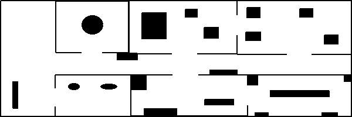

# Robot Laser Grid Mapping (ROS)

Mapping for known poses algorithm (ROS package) using log odds. 

Youtube Link: https://youtu.be/ykOTfrS5pO4

[](https://youtu.be/ykOTfrS5pO4)

The original map for the recorded bag: (Bag is generated using https://github.com/salihmarangoz/robot_laser_simulator)



## Features

- ROS (outputs `/map` and inputs `/scan`)
- Listens `map`->`base_link` transform.
- Demo bag is available.
- Map is updated when `(x,y)` position changes more than specified threshold.
- Map publish rate is limited.

## Running

```bash
$ roslaunch robot_laser_grid_mapping start.launch
```

